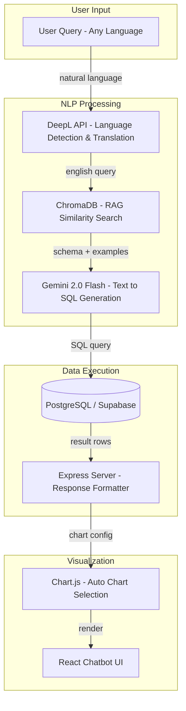
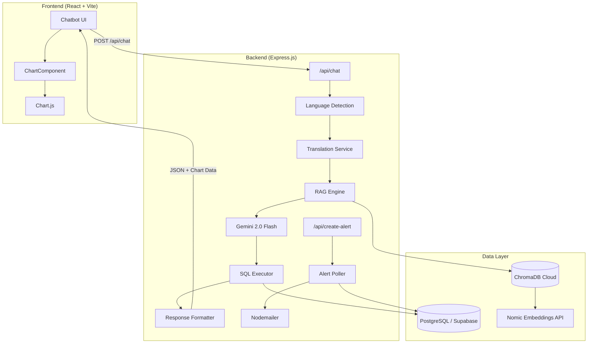

<p align="center">
  
  
  
  
  
  
</p>

# 💧 INGRES — Intelligent Natural-Language Groundwater Resource Exploration System

> **An AI-powered, multilingual chatbot that converts natural language questions into SQL queries, executes them against India's groundwater database, and returns dynamic, interactive visualizations — all in the user's own language.**

---

## 📌 Table of Contents

- [Problem Statement](#-problem-statement)
- [Solution Overview](#-solution-overview)
- [Key Features](#-key-features)
- [Architecture](#-architecture)
- [Tech Stack](#-tech-stack)
- [Database Schema](#-database-schema)
- [RAG Pipeline](#-rag-pipeline-retrieval-augmented-generation)
- [Project Structure](#-project-structure)
- [Getting Started](#-getting-started)
- [Environment Variables](#-environment-variables)
- [API Endpoints](#-api-endpoints)
- [Sample Queries](#-sample-queries)
- [Future Scope](#-future-scope)
- [License](#-license)

---

## 🧩 Problem Statement

India's groundwater data — scattered across assessment reports, well monitoring records, rainfall datasets, and policy zone classifications — is largely inaccessible to non-technical stakeholders such as policymakers, farmers, and civic administrators. Extracting actionable insights requires:

- Knowledge of SQL and database schemas
- Understanding of complex multi-table joins
- Ability to interpret raw tabular data

**INGRES bridges this gap** by enabling anyone to ask questions in plain natural language (in any supported language) and receive intelligent, visualized answers.

---

## 💡 Solution Overview

INGRES implements a **Text-to-SQL RAG (Retrieval-Augmented Generation) pipeline** that:

1. **Accepts** a natural language question in any of 11+ languages
2. **Detects** the input language and translates it to English (via DeepL API)
3. **Retrieves** relevant schema metadata and example question–query pairs from a ChromaDB vector store
4. **Generates** a precise PostgreSQL query using Google Gemini 2.0 Flash with zero-temperature, structured JSON output
5. **Executes** the SQL against a Supabase-hosted PostgreSQL database
6. **Selects** the optimal chart type (bar, line, pie, table, single value)
7. **Translates** column names and labels back into the user's language
8. **Renders** an interactive Chart.js visualization in a React chat interface



---

## ✨ Key Features

| Feature | Description |
|---|---|
| 🗣️ **Multilingual NLP** | Ask questions in English, Hindi, Spanish, French, German, Italian, Portuguese, Russian, Japanese, Chinese, Korean, and Arabic. Responses are automatically localized. |
| 🤖 **Intelligent Text-to-SQL** | Gemini 2.0 Flash converts natural language to optimized PostgreSQL — with schema-aware aliasing, aggregation handling, and `LIMIT` guards. |
| 🔍 **RAG-Powered Context** | ChromaDB vector store retrieves the most relevant schema columns and example Q&A pairs using Nomic embeddings, providing few-shot context to the LLM. |
| 📊 **Auto-Visualization** | The AI selects the best chart type (`bar`, `line`, `pie`, `table`, `single_value`) and generates Chart.js-ready data with human-readable titles. |
| 💬 **Conversational Memory** | Multi-turn chat history is sent to the model, enabling follow-up questions like *"What about Pune?"* after asking about Maharashtra. |
| 🔔 **Proactive Alerts** | Users can create custom SQL-based alerts. A background poller evaluates conditions every 30 seconds and sends email notifications via Nodemailer when thresholds are breached. |
| 📝 **Enterprise Logging** | Winston logger with file rotation (5 MB / 5 files), error-level separation, and optional MongoDB transport for centralized log management. |
| 📱 **Responsive UI** | Mobile-first React chatbot interface with typing indicators, auto-scroll, language detection badges, and smooth animations. |

---

## 🏛️ Architecture



---

## 🛠️ Tech Stack

### Frontend
| Technology | Purpose |
|---|---|
| **React 19** | Component-based UI framework |
| **Vite 7** | Lightning-fast HMR dev server and bundler |
| **Chart.js + react-chartjs-2** | Interactive bar, line, pie chart rendering |
| **Lucide React** | Lightweight SVG icon library |

### Backend
| Technology | Purpose |
|---|---|
| **Express 5** | REST API server |
| **Google Generative AI SDK** | Gemini 2.0 Flash for text-to-SQL generation |
| **ChromaDB (Cloud)** | Vector database for RAG similarity search |
| **Nomic Atlas API** | 768-dimensional text embeddings |
| **DeepL API** | Multilingual translation and language detection |
| **pg (node-postgres)** | PostgreSQL client for Supabase |
| **Nodemailer** | SMTP email notifications for alerts |
| **Winston** | Structured, multi-transport logging |
| **node-cron** | (Available) Scheduled task execution |

### Infrastructure
| Technology | Purpose |
|---|---|
| **Supabase** | Managed PostgreSQL hosting with SSL |
| **Chroma Cloud** | Hosted vector database |

---

## 🗃️ Database Schema

The system operates on **6 normalized tables** covering India's groundwater ecosystem:

```sql
-- 1. Groundwater Assessment (Public) — Block-level recharge, extraction, and classification
groundwater_assessment(State, District, Block, Year, Recharge_mcm, Extraction_mcm, Stage_pct, Category)

-- 2. Rainfall Data (Public) — Annual rainfall with deviation analysis
rainfall_data(State, District, Year, Annual_Rainfall_mm, Rainfall_Deviation_pct, Rainfall_Category)

-- 3. Well Monitoring (Restricted) — Monthly depth-to-water-level observations
well_monitoring(Well_ID, State, District, Block, Month, Year, Depth_to_Water_m, Observation_Type)

-- 4. Extraction Sources (Restricted) — Sector-wise extraction (Agriculture, Domestic, Industry)
extraction_sources(State, District, Year, Sector, Extraction_mcm)

-- 5. Policy Zones (Public) — Regulatory zone classifications
policy_zones(State, District, Block, Zone_Type, Notification_Year)

-- 6. Recharge Structures (Restricted) — Infrastructure projects (Check Dams, Percolation Tanks, etc.)
recharge_structures(Project_ID, State, District, Structure_Type, Capacity_mcm, Year_Completed, Status)
```

**Coverage:** 4 States · 8 Districts · 40 Blocks · 5 Years (2019–2023) · 200+ groundwater records · 800+ well observations

---

## 🔗 RAG Pipeline (Retrieval-Augmented Generation)

The core intelligence of INGRES lies in its RAG pipeline, which provides the LLM with contextually relevant schema and example queries:

### 1. Vector Store Population
```
schema.csv → Formatted Strings → Nomic Embeddings (768d) → ChromaDB "schema" collection
sample_questions.csv → Question Text → Nomic Embeddings (768d) → ChromaDB "questions" collection
```

### 2. Adaptive Retrieval Limits
The system dynamically computes retrieval limits based on dataset statistics:
```javascript
schema_limit = Math.floor(TOTAL_ALTS × EXPECTED_TABLES / TABLES) + 5   // ≈ 42 schema rows
questions_limit = Math.floor(Math.sqrt(QUESTIONS)) + 5                  // ≈ 15 example Q&A pairs
```

### 3. Schema Awareness
Each schema entry includes **column aliases** (e.g., `Stage_pct` → `stage_of_extraction_percentage`, `extraction_stage`), enabling the model to correctly map ambiguous natural language terms like *"extraction stage"* or *"usage percentage"* to the right column.

### 4. Structured Output
The LLM is prompted to return a strict JSON schema:
```json
{
  "sql_query": "SELECT ...",
  "chart_type": "bar | line | pie | table | single_value",
  "title_suggestion": "Human-Readable Chart Title",
  "one_line_answer": "The value is [value].",
  "explanation": "Justification for query and chart choice."
}
```

---

## 📂 Project Structure

```
Ingres/
├── .gitignore                         # Repository-wide ignore rules
├── README.md
│
├── data/                              # Seed data and schema definitions
│   ├── schema.sql                     # PostgreSQL table DDL + CSV import commands
│   ├── schema.csv                     # Column metadata with aliases (89 entries)
│   ├── sample_questions.csv           # 106 curated NL question → SQL query pairs
│   ├── groundwater_assessment.csv     # 200 block-level assessment records
│   ├── rainfall_data.csv              # Annual rainfall data
│   ├── well_monitoring.csv            # 800+ monthly well depth observations
│   ├── extraction_sources.csv         # Sector-wise extraction data
│   ├── policy_zones.csv               # Regulatory zone classifications
│   └── recharge_structures.csv        # Infrastructure project data
│
└── javascript/                        # Application root (npm project)
    ├── .env                           # Environment variables (API keys, DB config)
    ├── package.json                   # Dependencies and scripts
    ├── package-lock.json
    ├── vite.config.js                 # Vite + React plugin config
    ├── eslint.config.js               # ESLint flat config (React Hooks + Refresh)
    ├── index.html                     # Vite HTML entry point
    │
    ├── server/                        # Backend modules
    │   ├── server.js                  # Express API server (chat, alerts, email)
    │   ├── base.js                    # Core chatbot class (prompt engineering, Gemini)
    │   ├── vectordb.js                # ChromaDB Cloud client (add, query, clear)
    │   ├── translationService.js      # DeepL API (detect language + translate)
    │   ├── utils.js                   # PostgreSQL helpers, embeddings, ID hashing
    │   └── logger.js                  # Winston logger (file + console + error)
    │
    ├── scripts/                       # One-off utility scripts
    │   ├── populate-chroma-cloud.js   # Seed ChromaDB with schema + questions
    │   └── main.js                    # CLI test runner for the chatbot engine
    │
    ├── src/                           # React frontend
    │   ├── main.jsx                   # React DOM entry point
    │   ├── App.jsx                    # Root component
    │   ├── App.css                    # App-level styles
    │   ├── index.css                  # Global CSS reset and theming
    │   ├── assets/                    # Static assets
    │   │   └── react.svg
    │   └── components/                # UI components
    │       ├── Chatbot.jsx            # Chat UI (messages, input, language indicator)
    │       ├── Chatbot.css            # Chat interface styling (responsive, animations)
    │       └── ChartComponent.jsx     # Dynamic chart renderer (Bar, Line, Pie, Table)
    │
    └── public/
        └── vite.svg                   # Favicon
```

---

## 🚀 Getting Started

### Prerequisites

- **Node.js** ≥ 18.x
- **npm** ≥ 9.x
- A **PostgreSQL** database (Supabase recommended)
- API keys for: **Google Gemini**, **Nomic Atlas**, **DeepL**, **Chroma Cloud**

### 1. Clone the Repository

```bash
git clone https://github.com/krish-745/Ingres.git
cd Ingres
```

### 2. Set Up the Database

Import the schema and seed data into your PostgreSQL instance:

```bash
cd data
psql -h <your-db-host> -U postgres -d postgres -f schema.sql
cd ..
```

> **Note:** The `\copy` commands in `schema.sql` reference CSV filenames in the same directory. Run the command from within `data/`, or adjust paths if needed. You can also use Supabase's CSV import UI.

### 3. Install Dependencies

```bash
cd javascript
npm install
```

### 4. Configure Environment Variables

Create or update the `.env` file in the `javascript/` directory (see [Environment Variables](#-environment-variables)).

### 5. Populate the Vector Store

Run the one-time population script to seed ChromaDB with schema metadata and sample questions:

```bash
node scripts/populate-chroma-cloud.js
```

### 6. Start the Application

**Backend (API server):**
```bash
npm start          # Starts Express on http://localhost:3001
```

**Frontend (dev server):**
```bash
npm run dev        # Starts Vite on http://localhost:5173
```

---

## 🔐 Environment Variables

Create a `.env` file in the `javascript/` directory:

```env
# DeepL API (Translation & Language Detection)
DEEPL_API_KEY=your_deepl_api_key

# PostgreSQL Database (Supabase)
DB_USER=postgres
DB_HOST=your-project.supabase.co
DB_DATABASE=postgres
DB_PASSWORD=your_db_password
DB_PORT=5432

# ChromaDB Cloud (Vector Store)
CHROMA_API_KEY=your_chroma_api_key
CHROMA_TENANT=your_tenant_id
CHROMA_DATABASE=ingres

# Nomic Atlas (Embeddings)
NOMIC_API_KEY=your_nomic_api_key

# Google Gemini (LLM)
GEMINI_API_KEY=your_gemini_api_key

# SMTP Email (Alert Notifications)
EMAIL_HOST=smtp.gmail.com
EMAIL_PORT=587
EMAIL_USER=your_email@gmail.com
EMAIL_PASS=your_app_password

# Dataset Statistics (for RAG retrieval limit computation)
TABLES=6
TOTAL_ALTS=89
EXPECTED_TABLES=2.5
QUESTIONS=106
```

---

## 📡 API Endpoints

### `POST /api/chat`

Main conversational endpoint — accepts a natural language question and returns structured chart data.

**Request:**
```json
{
  "question": "Which districts in Karnataka experienced a drought in 2022?",
  "history": [
    { "role": "user", "content": "Tell me about Karnataka" },
    { "role": "bot", "content": "Generated a chart: ..." }
  ]
}
```

**Response:**
```json
{
  "chartType": "table",
  "title": "Drought-Affected Districts in Karnataka (2022)",
  "oneLineAnswer": null,
  "data": [
    { "district": "Bangalore Urban", "annual_rainfall_mm": 542.3 }
  ],
  "userLanguage": "EN"
}
```

### `POST /api/create-alert`

Create a custom SQL-based alert with email notifications.

**Request:**
```json
{
  "email": "admin@example.com",
  "sql": "SELECT AVG(Stage_pct) FROM groundwater_assessment WHERE State = 'Maharashtra' AND Year = 2023",
  "operator": ">",
  "value": 90,
  "message": "Maharashtra's average extraction stage has exceeded 90%!"
}
```

### `GET /api/test-db`

Health check endpoint to verify database connectivity.

---

## 💬 Sample Queries

Here are some example natural language questions INGRES can handle:

| Category | Example Question |
|---|---|
| **Trend Analysis** | *"How has the groundwater refill changed over the years for Block_1 in Kanpur?"* |
| **Comparison** | *"Compare the average groundwater usage for different blocks in Pune during 2022."* |
| **Aggregation** | *"What was the highest extraction percentage in 2023?"* |
| **Distribution** | *"What was the distribution of groundwater categories in Maharashtra in 2023?"* |
| **Cross-Table** | *"Did the 2022 drought in Pune affect its groundwater status in 2023?"* |
| **Policy Analysis** | *"Are groundwater levels in 'Notified' zones in Pune better than 'Non-Notified' zones?"* |
| **Multilingual** | *"कर्नाटक में 2022 में सूखा किन जिलों में पड़ा?"* (Hindi) |
| **Infrastructure** | *"List active recharge projects in districts that are currently 'Critical'."* |

---

## 🔮 Future Scope

- **Voice Input** — Integration with Web Speech API for spoken queries
- **Geospatial Visualization** — Map-based overlays using Leaflet/Mapbox for district-level heatmaps
- **User Authentication** — Role-based access control for restricted datasets (well monitoring, extraction sources)
- **Scheduled Reports** — Automated daily/weekly PDF reports via node-cron
- **Fine-Tuned Model** — Domain-specific fine-tuning on groundwater terminology for higher SQL accuracy
- **Real-Time Data Ingestion** — Live data feeds from Central Ground Water Board (CGWB) APIs
- **Export & Download** — CSV/PDF export of chart data and query results

---

## 📄 License

This project was developed as part of the **Smart India Hackathon (SIH)** initiative. All rights reserved.

---

<p align="center">
  <b>Built with ❤️ for India's water future</b>
</p>
